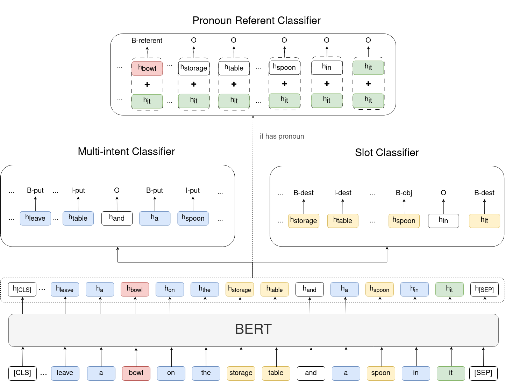

# RoboNLU: Advancing Command Understanding with a Novel Lightweight BERT-based Approach for Service Robotics

Pytorch implementation of `RoboNLU`: Advancing Command Understanding with a Novel Lightweight BERT-based Approach for Service Robotics


## Insight
This paper proposes a novel approach to natural language understanding (NLU) in service robots called RoboNLU, which leverages pre-trained language models along with specialized classifiers to extract meaning from user commands. Specifically, the proposed system utilizes BERT model in conjunction with slot, intent, and pronoun resolution classifiers.
The model was trained on a newly created, large-scale, and high-quality GPSR (General Purpose Service Robot) command dataset, yielding impressive results in intent classification, slot filling, and pronoun resolution tasks while also demonstrating robustness in out-of-vocabulary scenarios. Furthermore, the system was optimized for real-time processing on a service robot by leveraging smaller, quantized versions of the BERT-base model and deploying the system using the ONNXruntime framework


## Model Architecture
<p float="left" align="center">
      
</p>


## Dataset
- The following table includes the train/dev/test split ofEGPSR dataset. Also, we reports the number of intent labels and slot labels in the training set.

|       | Train  | Dev | Test | Intent Labels | Slot Labels |Pronoun Labels |
| ----- | ------ | --- | ---- | ------------- | ----------- |----------- |
| EGPSR  | 45,250  | 3,016 | 12,068| 9        | 5           |   3       |

- The number of labels is based on the _train_ dataset.
- Add `UNK` and `PAD` for intent and slot labels 


## Results
<p float="left" align="center">
      
</p>


## References

- [Huggingface Transformers](https://github.com/huggingface/transformers)
- [pytorch-crf](https://github.com/kmkurn/pytorch-crf)
- [JointBert](https://github.com/monologg/JointBERT)

## Citations

If you use this project, please consider citing:

```
@inproceedings{10.1007/978-3-031-55015-7_3,
  author    = {Wang, Sinuo
               and Neau, Ma{\"e}lic
               and Buche, C{\'e}dric},
  editor    = {Buche, C{\'e}dric
               and Rossi, Alessandra
               and Sim{\~o}es, Marco
               and Visser, Ubbo},
  title     = {RoboNLU: Advancing Command Understanding with a Novel Lightweight BERT-Based Approach for Service Robotics},
  booktitle = {RoboCup 2023: Robot World Cup XXVI},
  year      = {2024},
  publisher = {Springer Nature Switzerland},
  address   = {Cham},
  pages     = {29--41},
  isbn      = {978-3-031-55015-7}
}

```
