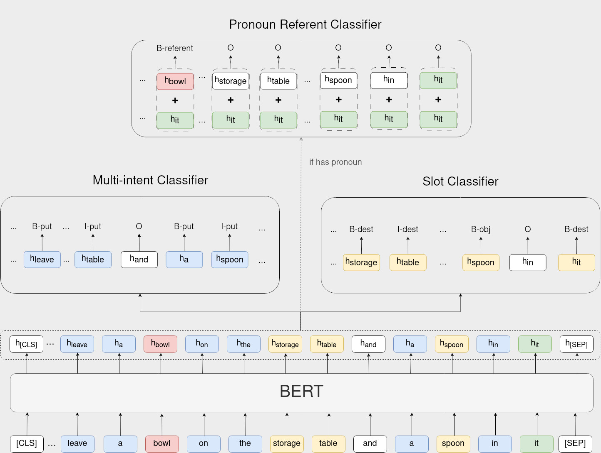
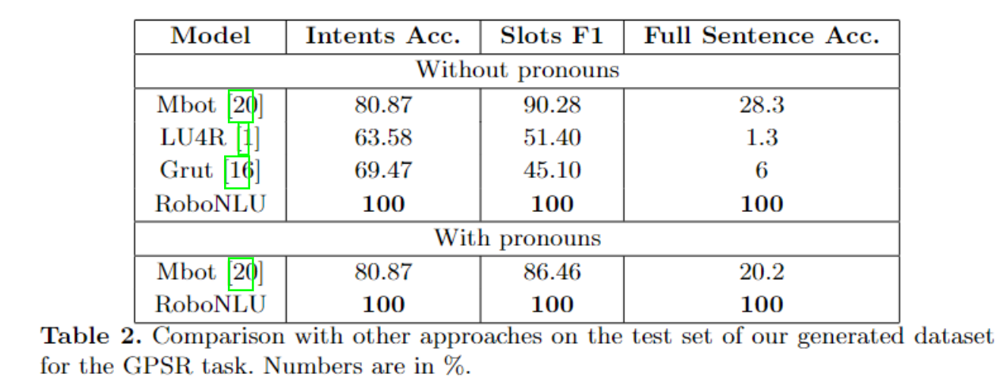

# RoboNLU: Advancing Command Understanding with a Novel Lightweight BERT-based Approach for Service Robotics

[](LICENSE)
[](https://www.python.org/)
[](https://pytorch.org/)

Pytorch implementation of the paper [RoboNLU: Advancing Command Understanding with a Novel Lightweight BERT-based Approach for Service Robotics](https://link.springer.com/chapter/10.1007/978-3-031-55015-7_3).


## TODO

- [ ] Open-Source model weights.


## Insight
This paper proposes a novel approach to natural language understanding (NLU) in service robots called RoboNLU, which leverages pre-trained language models along with specialized classifiers to extract meaning from user commands. Specifically, the proposed system utilizes BERT model in conjunction with slot, intent, and pronoun resolution classifiers.
The model was trained on a newly created, large-scale, and high-quality GPSR (General Purpose Service Robot) command dataset, yielding impressive results in intent classification, slot filling, and pronoun resolution tasks while also demonstrating robustness in out-of-vocabulary scenarios. Furthermore, the system was optimized for real-time processing on a service robot by leveraging smaller, quantized versions of the BERT-base model and deploying the system using the ONNXruntime framework


## Model Architecture
<p float="left" align="center">
      
</p>


## Dataset
- The following table includes statistics for the introduced EGPSR dataset (split=```gpsr_pro_instance_say```). Also, we report the number of intent labels and slot labels in the training set.

|       | Train  | Dev | Test | Intent Labels | Slot Labels |Pronoun Labels |
| ----- | ------ | --- | ---- | ------------- | ----------- |----------- |
| EGPSR  | 45,250  | 3,016 | 12,068| 9        | 5           |   3       |

- The number of labels is based on the _train_ dataset.
- Add `UNK` and `PAD` for intent and slot labels 

A few different versions of the dataset have been tested, for the tasks of GPSR and EGPSR. The data split ```gpsr``` is the base dataset, with no pronouns annotations and no ```say``` instances (i.e. for GPSR only, as EGPSR contains ```say``` commands such as "Tell me how many people are raising their arm in the kitchen.").

The ```gpsr_pro_instance_say``` is the final split of the data that can be used for both GPSR and EGPSR, it contains the most complex commands and annotations for the ```say``` intent. You can find the different splits and annotations scripts in the [data](./data) folder.

## Results
<p float="left" align="center">
      
</p>


# Install

It is recommended to create a new conda environment before training:
```
conda env create robonlu python=3.11
```

Then, install [your favorite PyTorch version](https://pytorch.org/get-started/previous-versions/).


Install dependencies with the requirements.txt file:
```
pip install -r requirements.txt
```

Finally setup the project:

```
pip install .
```

# Training

You can train different versions of the BERT model using the ```main.py``` script. For instance, to train a distilbert model on the full EGPSR dataset (with "say" commands), you can do:

```
python robonlu/main.py --task gpsr_pro_instance_say --model_dir ./checkpoints/ --do_train --multi_intent 1 --num_train_epochs 10 --model_type distilbert 
```

To train a mobilebert model:

```
python robonlu/main.py --task gpsr_pro_instance_say --model_dir ./checkpoints/ --do_train --multi_intent 1 --num_train_epochs 10 --model_type mobilebert 
```

# Converting to ONNX

In the original implementation, we perform inference using the ONNXRUNTIME engine. To do so, we need to convert the weights from PyTorch format to onnx, which can be done using the ```to_onnx.py``` script. This script also convert the classifiers weights and biases to numpy format. Here we split the runtime implementation between the base model (inference with onnxruntime) and the classifiers (inference with numpy) for modularity (for instance, the pronoun classifier inference can be skipped if the sentence contains no pronoun).

```
 python export/to_onnx.py --model_path ./checkpoints/distilbert/model.pth --model_type distilbert --out_path ./onnx_models/distilbert
```

# Inference

The ```predict_robot.py``` script provides a simple and straightforward implementation of the approach that can be tested directly onboard a robot. This implementation only requires the ```onnxruntime```, ```transformers``` and ```numpy``` package to run. The ```transformers``` does not need to be built for inferencing as we only use it for the ```AutoTokenizer``` class. Once you have your onnx model and the classifiers in ```.npy``` format, you can test inference on your robot as follows:
```
python predict_robot.py --model_name distilbert --input_text_path ./test/sample_pred_in.txt --model_path ./onnx_models/distilbert
```


## References

- [Huggingface Transformers](https://github.com/huggingface/transformers)
- [pytorch-crf](https://github.com/kmkurn/pytorch-crf)
- [JointBert](https://github.com/monologg/JointBERT)

## Citations

If you use this project, please consider citing:

```
@incollection{wang2023robonlu,
  title={RoboNLU: advancing command understanding with a novel lightweight bert-based approach for service robotics},
  author={Wang, Sinuo and Neau, Ma{\"e}lic and Buche, C{\'e}dric},
  booktitle={Robot World Cup},
  pages={29--41},
  year={2023},
  publisher={Springer}
}

```
